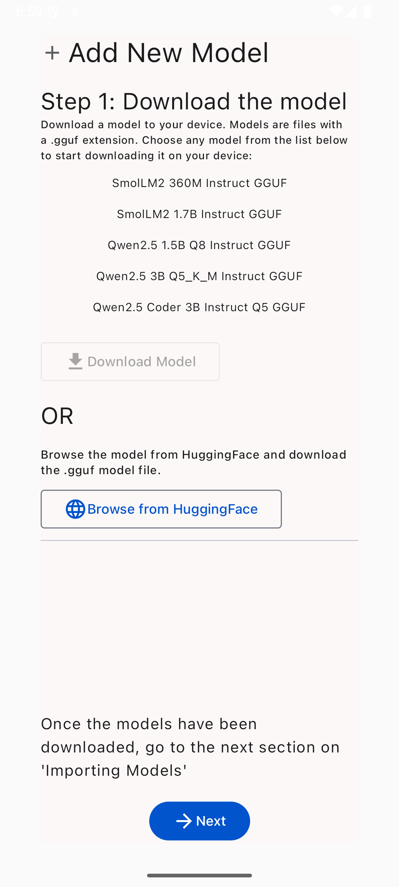
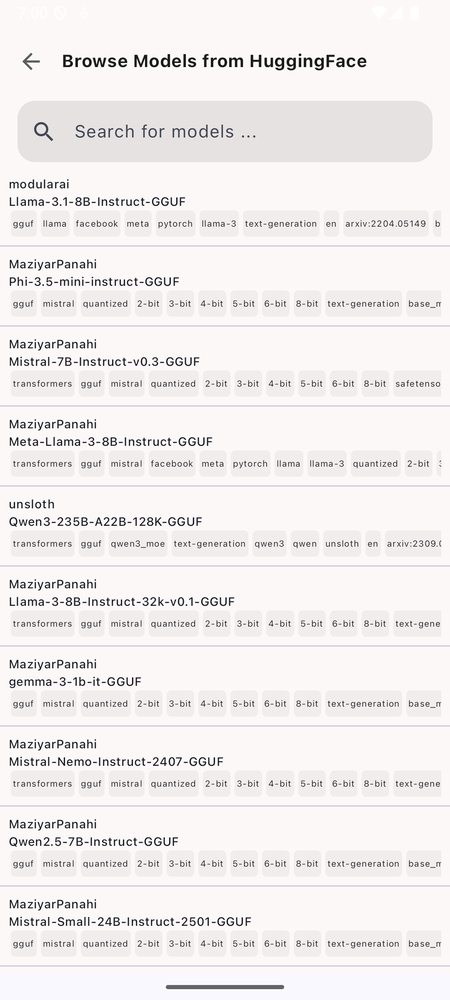
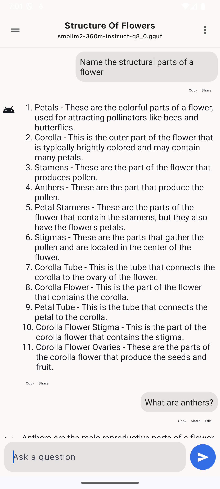
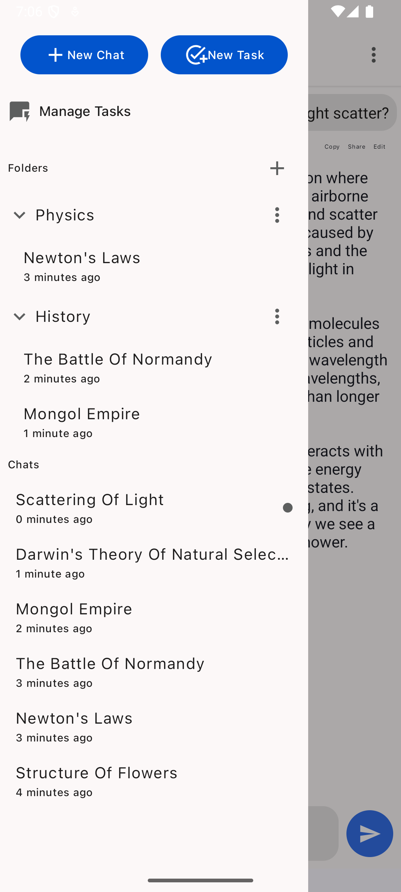
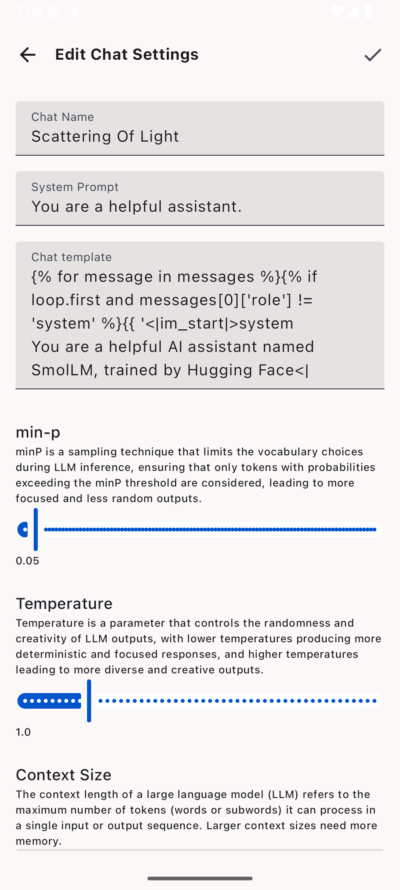
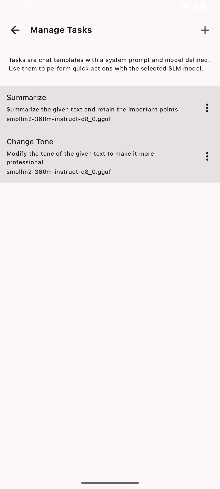

# Aigentik - On-Device AI Assistant with Email, Calendar & SMS Integration

<table>
<tr>
<td>

</td>
<td>

</td>
<td>

</td>
</tr>
<tr>
<td>

</td>
<td>

</td>
<td>

</td>
</tr>
</table>

## Features

### 🤖 On-Device LLM Inference
- Run GGUF format models locally on your Android device
- No internet required for inference
- Modify system prompts and inference parameters (temperature, min-p)
- Create custom tasks with specific system prompts

### 📧 Email Integration
- Connect multiple email providers (Gmail, Outlook, IMAP/SMTP)
- Read and draft AI-powered email responses
- Send emails directly from the app
- Manage labels and folders
- Trash management (move to trash, empty trash)
- Google Voice integration - respond to voicemails as SMS

### 📅 Calendar Integration
- Google Calendar and system calendar support
- View, create, modify, and delete events
- AI-powered scheduling suggestions
- Find free time slots for meetings
- Natural language event creation

### 💬 SMS/RCS Integration
- Intercept notifications from Google Messages, Samsung Messages
- AI-powered reply suggestions for incoming messages
- Quick reply via notification action buttons
- RCS support through notification reply interface
- Direct SMS send/receive capability

## Installation

### GitHub (Debug APK)

1. Download the latest APK from [GitHub Releases](https://github.com/YOUR_USERNAME/Aigentik/releases/) and transfer it to your Android device.
2. If your device does not allow downloading APKs from untrusted sources, search for **how to allow downloading APKs from unknown sources** for your device.

### Build from Source

1. Clone the repository with its submodule originating from llama.cpp:

```commandline
git clone --depth=1 https://github.com/YOUR_USERNAME/Aigentik.git
cd Aigentik
git submodule update --init --recursive
```

2. Android Studio starts building the project automatically. If not, select **Build > Rebuild Project** to start a project build.

3. After a successful project build, [connect an Android device](https://developer.android.com/studio/run/device) to your system. Once connected, the name of the device must be visible in top menu-bar in Android Studio.

## CI/CD Build

Aigentik uses GitHub Actions to automatically build APKs on every push:

1. Push your code to GitHub
2. GitHub Actions will automatically build debug and release APKs
3. Download the APK from the **Actions** tab > Select the workflow run > Download artifacts

### Setting up Release Signing (Optional)

To build signed release APKs, add the following secrets to your GitHub repository:

- `KEYSTORE_BASE_64`: Base64 encoded keystore file
- `RELEASE_KEYSTORE_PASSWORD`: Keystore password
- `RELEASE_KEYSTORE_ALIAS`: Keystore alias
- `RELEASE_KEY_PASSWORD`: Key password

## Permissions

Aigentik requires the following permissions for its features:

### Core Permissions
- `INTERNET` - For model downloads and API calls
- `RECORD_AUDIO` - For voice input

### Email Permissions
- `GET_ACCOUNTS` - Access email accounts
- `USE_CREDENTIALS` - Authenticate with email providers

### Calendar Permissions
- `READ_CALENDAR` - Read calendar events
- `WRITE_CALENDAR` - Create/modify calendar events

### SMS Permissions
- `READ_SMS` - Read SMS messages
- `SEND_SMS` - Send SMS messages
- `RECEIVE_SMS` - Receive SMS messages
- `BIND_NOTIFICATION_LISTENER_SERVICE` - Listen to messaging app notifications

### Background Services
- `FOREGROUND_SERVICE` - Run background listeners
- `POST_NOTIFICATIONS` - Show notifications

## Project Structure

```
Aigentik/
├── app/                          # Main application module
│   └── src/main/java/com/aigentik/assistant/
│       ├── data/                 # Room database, data models
│       ├── llm/                  # LLM inference (SmolLM)
│       ├── email/                # Email integration
│       ├── calendar/             # Calendar integration
│       ├── sms/                  # SMS/RCS integration
│       ├── ui/                   # Jetpack Compose UI
│       └── prism4j/              # Code syntax highlighting
├── smollm/                       # JNI bindings for llama.cpp
├── smolvectordb/                 # Vector database module
├── hf-model-hub-api/             # Hugging Face API
├── llama.cpp/                    # llama.cpp submodule
└── .github/workflows/            # GitHub Actions CI/CD
```

## Technologies

* [ggerganov/llama.cpp](https://github.com/ggerganov/llama.cpp) - Pure C/C++ framework for running ML models on Android
* [noties/Markwon](https://github.com/noties/Markwon) - Markdown rendering with code syntax highlighting
* [Android Room](https://developer.android.com/training/data-storage/room) - Local database
* [Jetpack Compose](https://developer.android.com/jetpack/compose) - Modern UI toolkit
* [Koin](https://insert-koin.io/) - Dependency injection

## Usage

### First Time Setup

1. Launch Aigentik on your device
2. Download a GGUF model from the built-in model browser or import one from Hugging Face
3. Start chatting with your on-device AI assistant!

### Email Setup

1. Go to Settings > Email Accounts
2. Add your email account (Gmail, Outlook, or IMAP)
3. Grant necessary permissions
4. Start using AI to draft and send emails

### Calendar Setup

1. Go to Settings > Calendar
2. Grant calendar permissions
3. Enable the calendars you want to use
4. Ask AI to schedule meetings or check your availability

### SMS Setup

1. Go to Settings > SMS/RCS
2. Enable Notification Listener for Aigentik
3. Grant SMS permissions
4. Enable AI reply suggestions for incoming messages

## Building APKs

### Debug APK
```bash
./gradlew assembleDebug
```

### Release APK (requires signing)
```bash
./gradlew assembleRelease
```

## Contributing

Contributions are welcome! Please feel free to submit a Pull Request.

## License

```
Copyright (C) 2024 Aigentik

Licensed under the Apache License, Version 2.0 (the "License");
you may not use this file except in compliance with the License.
You may obtain a copy of the License at

     http://www.apache.org/licenses/LICENSE-2.0

Unless required by applicable law or agreed to in writing, software
distributed under the License is distributed on an "AS IS" BASIS,
WITHOUT WARRANTIES OR CONDITIONS OF ANY KIND, either express or implied.
See the License for the specific language governing permissions and
limitations under the License.
```

## Acknowledgements

This project is a fork of [SmolChat-Android](https://github.com/shubham0204/SmolChat-Android) by Shubham Panchal, extended with email, calendar, and SMS integration capabilities.
# Test build
